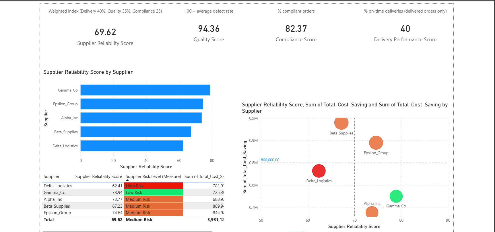
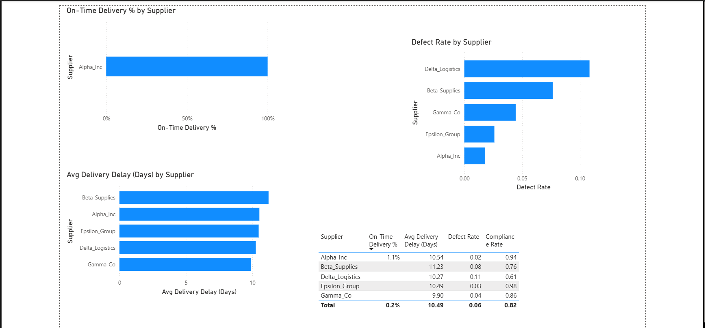

# Supplier Performance Dashboard  
### Procurement KPI Analytics with Power BI

This project presents a **multi-layered supplier performance analysis** combining operational reliability, risk exposure, and financial impact.  
The dashboard is designed to support **data-driven procurement decisions** such as supplier prioritization, risk mitigation, and value optimization.

---

## Dashboard Structure

The analysis is organized into **three analytical views**, each answering a distinct business question.

---

## 1️⃣ Supplier Overview & Risk–Value Trade-off

This view evaluates suppliers across two critical dimensions:

- **Supplier Reliability Score** (composite of delivery, quality, and compliance)
- **Total Cost Savings** generated per supplier

Suppliers are classified into **actionable quadrants**:
- **Strategic Partners** (high reliability, high value)
- **Value Opportunities** (moderate reliability, high value)
- **At-Risk Suppliers** (low reliability, high value)
- **Reliable but Low Impact** (high reliability, low value)

Bubble color represents **Risk Level**, while bubble size reflects **transaction volume**, enabling rapid prioritization.

---

## 2️⃣ Operational Diagnostics

This section focuses on **root-cause indicators** driving supplier performance:

- **On-Time Delivery %**
- **Average Delivery Delay (Days)**
- **Defect Rate**
- **Compliance Rate**

These metrics help identify whether reliability issues stem from logistics, quality failures, or process non-compliance.

---

## 3️⃣ Financial Impact & Action Prioritization

This view translates operational performance into **financial consequences**:

- Total cost savings by supplier
- Unit cost savings
- Reliability vs. value positioning

The accompanying table consolidates **risk level, reliability score, cost savings, and defect rates**, enabling procurement teams to:

- Prioritize negotiations
- Flag suppliers for corrective action
- Protect high-value relationships

---

## Methodology

Key features of the analytical model include:

- **Weighted Supplier Reliability Index**
  - Delivery Performance: 40%
  - Quality Score: 35%
  - Compliance Score: 25%
- Dynamic risk classification using DAX
- Quadrant thresholds locked for analytical consistency
- Conditional formatting to highlight risk exposure

---

## Tools & Technologies

- **Power BI** — data modeling, DAX, and visualization
- **Excel** — data cleaning and preprocessing
- **GitHub Pages** — documentation and portfolio publishing

---

## Use Cases

- Procurement performance reviews
- Supplier risk assessment
- Strategic sourcing decisions
- Cost optimization initiatives

---

📌 *This project demonstrates applied analytics for real-world procurement decision-making, with an emphasis on clarity, interpretability, and actionability.*
